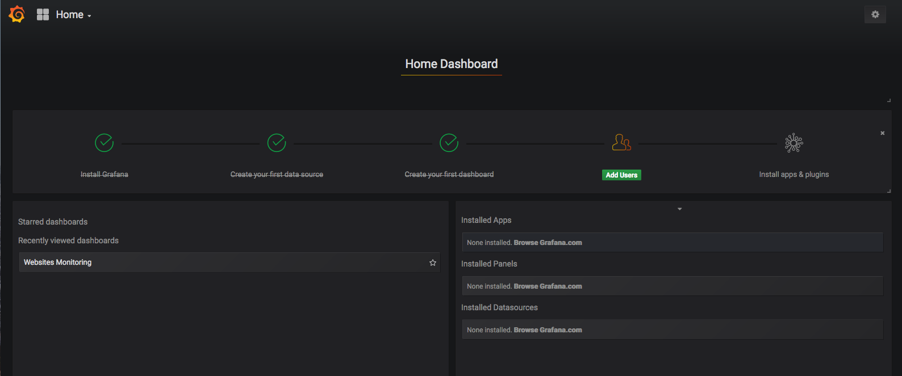
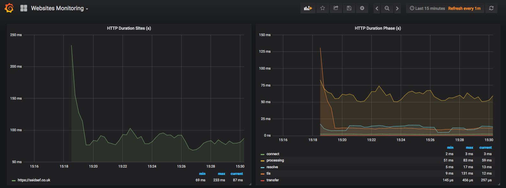
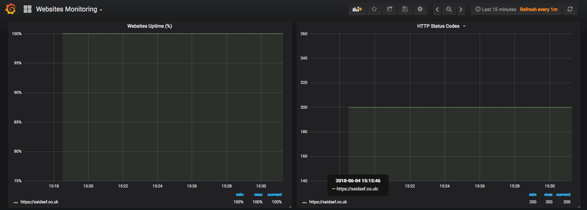
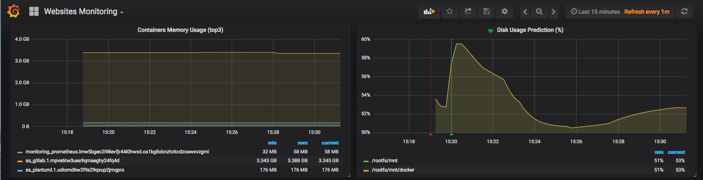

# Prom-Docker-Swarm

This is a starter kit for Docker Swarm Monitoring.

In order to collect metrics from Swarm nodes you need to deploy the exporters on each server. Using global services you don't have to manually deploy the exporters.

When you scale up your cluster, Swarm will launch a cAdvisor and node-exporter instances on the newly created nodes.

## Prerequisites
 - Docker Engine >= 17.x
 - Swarm Cluster

## Tech Stack
 - Grafana
 - Prometheus
 - cAdvisor
 - AlertManager
 - Node Exporter
 - Blackbox Exporter

## Swarm Prometheus Configuration

To configure the Docker daemon as a Prometheus target, you need to specify the `metrics-address`. The best way to do this is via the `daemon.json`, which is located at one of the following locations by default. If the file does not exist, create it.

### Configuration file location
```bash
/etc/docker/daemon.json
```

```bash
{
  "metrics-addr" : "127.0.0.1:4999",
  "experimental" : true
}
```
## Deployment

You can use the provided `docker-compose.yml` file as an example. You can deploy the full stack with the command.

```bash
docker swarm init
docker stack deploy -c docker-compose.yml monitoring
```

## Services Access
 - Grafana `http://<swarm-address>:3000/` `(admin:admin)`
 - Prometheus `http://<swarm-address>:9090/`
 - AlertManager `http://<swarm-address>:9093/`

## Grafana Dashboard Panels
 - HTTP Duration (s)
 - HTTP Duration Phase (s)
 - HTTP Status Code
 - Websites Uptime (%)
 - Containers Memory Usage (top 3)
 - Disk Usage Prediction (%)
 - Websites SSL Expiry (Days)
 - Websites Request Rates (s)
 - Websites DNS Lookup (s)
 - Websites Total
 - Websites Down

## Screenshots





